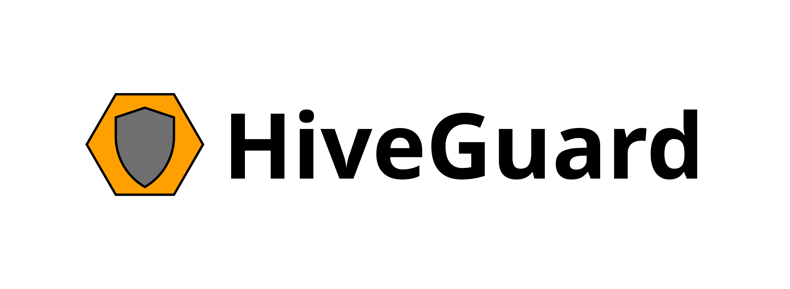

# hiveguard-backend

Backend for HiveGuard


## Instructions

Currently, you can install the HiveGuard backend servers as follows:
```console
$ git clone https://github.com/akestoridis/hiveguard-backend.git
$ cd hiveguard-backend/
$ npm install
```

Then, you can launch an individual HiveGuard backend server by running the script with the matching name, e.g.:
```console
$ npm run retention
```

During development, you can launch the HiveGuard inspection, aggregation, and retention servers by executing the following command:
```console
$ npm run start:dev
```


## Publication

HiveGuard was used in the following publication:

* D.-G. Akestoridis and P. Tague, “HiveGuard: A network security monitoring architecture for Zigbee networks,” to appear in Proc. IEEE CNS’21.


## Acknowledgments

This project was supported in part by the CyLab Security and Privacy Institute.


## License

Copyright 2021 Dimitrios-Georgios Akestoridis

This project is licensed under the terms of the Apache License, Version 2.0 (Apache-2.0).
